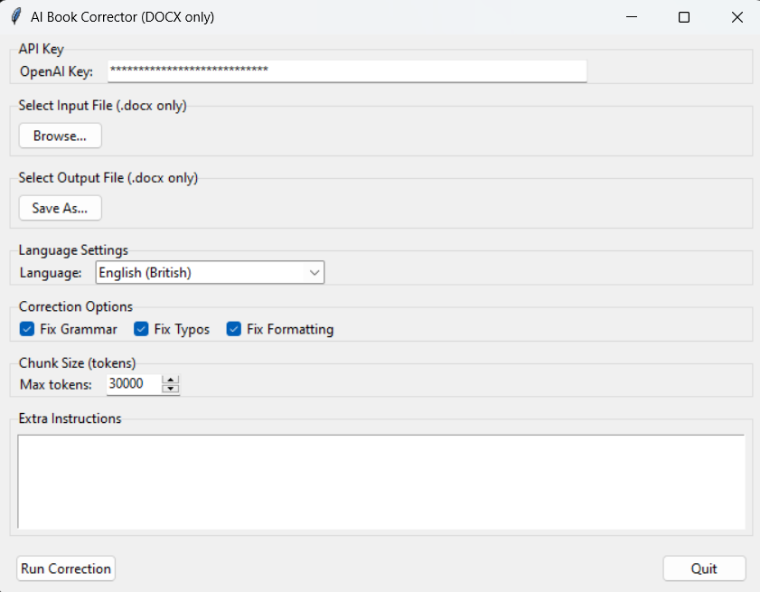

# AI Book Corrector

A GUI application for automated book correction using GPT-4o-mini. This tool helps authors and editors improve their DOCX documents by fixing grammar, typos, and formatting while preserving the original writing style.

 

## Features

- 📝 Supports DOCX files exclusively (both input and output)
- 🌍 Multi-language support with 60+ languages
- ⚡ Efficient processing using GPT-4o-mini (fast and cost-effective)
- 🔧 Customizable correction options:
  - Grammar correction
  - Typo fixing
  - Formatting improvement
- 📊 Smart text chunking (default: 30,000 tokens)
- 💬 Support for custom correction instructions
- 🎨 Clean and intuitive user interface
- 📋 Right-click paste support for API key

## Quick Start

1. Install Python 3.8 or newer
2. Download this repository
3. Run `start.bat`
4. Enter your OpenAI API key in the application
5. Select your DOCX file and start correcting!

## Installation

### Prerequisites

- Python 3.8+
- OpenAI API key with GPT-4o-mini access

### Setup

1. Clone the repository:
   ```bash
   git clone https://github.com/roundyyy/AI-book-corrector.git
   cd ai-book-corrector
   ```

2. Install required packages:
   ```bash
   pip install -r requirements.txt
   ```

3. Start the application:
   ```bash
   python book_corrector.py
   ```
   
Or simply double-click `start.bat`

### Requirements

- `python-docx`: For DOCX file handling
- `requests`: For API communication
- `tiktoken`: For token counting
- `tkinter`: For GUI (usually comes with Python)

## Usage

1. **Launch the Application**
   - Run `start.bat` or execute `python book_corrector.py`

2. **Configure Settings**
   - Paste your OpenAI API key
   - Select input DOCX file
   - Choose output location
   - Select target language
   - Configure correction options
   - Adjust chunk size if needed
   - Add any special instructions

3. **Run Correction**
   - Click "Run Correction"
   - Wait for the process to complete
   - Check your corrected document

## Important Notes

- 🔑 Requires valid OpenAI API key with GPT-4o-mini access
- 📄 Only processes DOCX files
- 💾 Always keep a backup of your original files
- ⚠️ Large documents are processed in chunks
- 💰 API usage will incur charges based on OpenAI's pricing

## Technical Features

- Threading support for responsive GUI
- JSON-based correction protocol
- Proper error handling and user feedback
- Customizable token chunk size
- Maintains document styling and formatting
- Support for various text styles (normal, heading, italic, bold, quote)

## Limitations

- Only supports DOCX format
- Requires active internet connection
- Processing speed depends on API response time
- Maximum chunk size of 128k tokens

## Troubleshooting

- **API Key Error**: Ensure your OpenAI key starts with "sk-" and has access to GPT-4o-mini
- **File Format Error**: Verify you're using DOCX format
- **Processing Error**: Try reducing chunk size
- **Missing Packages**: Run `pip install -r requirements.txt` again

## Contributing

Feel free to submit issues, fork the repository, and create pull requests for any improvements.


## Acknowledgments

- Built using OpenAI's GPT-4o-mini API
- Uses python-docx for document processing
- Interface built with tkinter

